# DiverseXEngine

## Overview

### Purpose and Scope
DiversXEngine is Qt-based visual node programming editor that enables users to create and execute computational graphs through an intuative drag-and-drop interface.

### System Architecture
**DiverseXEngine System Architecture**

### Core Components
The engine is organized into several key subsystem that work together to provide visual node pragamming capablities:

| Component| Purpose| Key Classes|
|---------------|--------------------------------|------------------------------|
|Application Layer| Application entry point and main UI| `main.cpp`, `MainWindow`, `NodeRegistry`|
|Canvas System| Interactive editing area for node manipulation| `CanvasView`, `CanvasScene`, `Helper`   |
|Graphics Layer| Visual representation of graph elements| `NodeGraphics`, `EdgeGraphics`, `SocketGraphics`|
|Data Model| Core graph data structures and logic| `Scene`, `Node`, `EdgesNode`, `SocketNode`|
|Widget System| Custom UI components within nodes| `WidgetNode`, `TextEdit`|
|Save and Load| Serialization and file I/O operations|`Serializable`, `Serializator`|

### Node-Based Programming Model
DataFlow for programming as below:

```mermaid
graph TD
  subgraph Input_Nodes
    in1[InputNode]
  end

  subgraph Connection_System
    sock1[SocketNode]
    edge1[EdgesNode]
    sock2[SocketNode]
    edge2[EdgesNode]
  end

  subgraph Function_Nodes
    add[AddNode]
    mul[MulNode]
    sub[SubNode]
    div[DivNode]
  end

  subgraph Output_Nodes
    out1[OutputNode]
  end

in1-->sock1-->edge1
edge1-->add-->sock2
edge1-->sub-->sock2
edge1-->mul-->sock2
edge1-->div-->sock2

sock2-->edge2-->out1




  
```

### Current Features
- **Visual Node Editor:** Canvas with drag-and-drop-node manipulation
- **Edge Connection System:** Connection between node socket with graphics rendering
- **Node Selection and Deletion:** Multi-select operations and deletion.
- **Math Operations:** Addition(`AddNode`), Subtraction(`SubNode`), multiplication(`MulNode`), and division(`DivNode`) nodes
- **Edge Cutting:** Interactive edge delection using cutting tools
- **Serialization:** Save and load node graphs to/from JSON format
- **Socket System:** Typed connection points with multiple socket types

### Techonolgy Stack

- **Qt Framework**: Cross-platform GUI framework.
- **Qt Graphics View**: Scene-based graphics randering for node editor.
- **C++**: core implementation language
- **JSON**: Graph serialization and deserialization.

##
